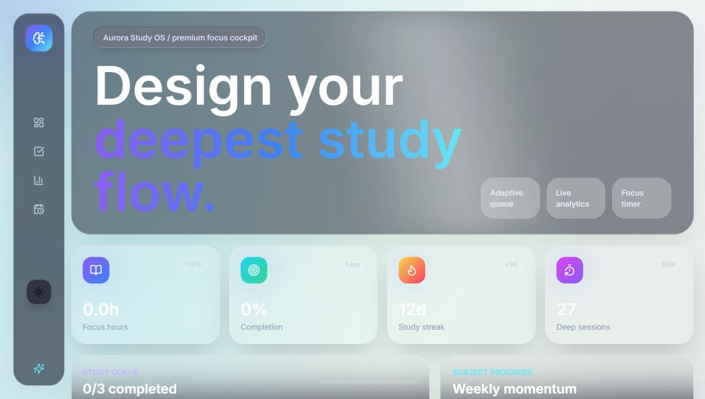

# Aurora Study OS

[](https://react.dev/)
[](https://vite.dev/)
[](https://tailwindcss.com/)
[](https://www.framer.com/motion/)

A premium futuristic study dashboard built with React, Vite, Tailwind CSS, Framer Motion, GSAP, Recharts, and Lucide icons. Aurora Study OS is designed as a cinematic productivity cockpit for students who want task planning, progress tracking, analytics, and focus sessions in one polished interface.



## Features

- Animated dashboard homepage with cinematic GSAP hero reveal
- Add, edit, delete, and complete study tasks
- Local storage persistence for tasks and theme preference
- Subject-wise weekly progress tracker
- Daily study analytics with animated Recharts visualizations
- Productivity stat cards with animated counters
- Dark and light mode with smooth visual transitions
- Pomodoro timer with animated progress ring
- Motivational quote card with micro interactions
- Glassmorphism panels, glowing borders, blur effects, and neon gradients
- Cursor-following background glow and mouse-reactive cards
- Loading skeleton screen
- Fully responsive layout for desktop, tablet, and mobile

## Tech Stack

- React
- Vite
- Tailwind CSS
- Framer Motion
- GSAP
- Recharts
- Lucide React Icons

## Project Structure

```text
aurora-study-dashboard/
  docs/
    screenshots/
      dashboard-preview.png
  src/
    components/
      AnalyticsChart.jsx
      AnimatedBackground.jsx
      MotionNumber.jsx
      Pomodoro.jsx
      PremiumCard.jsx
      ProgressTracker.jsx
      QuoteCard.jsx
      Sidebar.jsx
      SkeletonLoader.jsx
      StatCard.jsx
      TaskPanel.jsx
    data/
      seed.js
    hooks/
      useLocalStorage.js
      useTheme.js
    styles/
      index.css
    App.jsx
    main.jsx
  index.html
  package.json
  tailwind.config.js
  vite.config.js
```

## Setup

Clone and install:

```bash
git clone https://github.com/jagdaleaditya/aurora-study-dashboard.git
cd aurora-study-dashboard
npm install
```

Start the development server:

```bash
npm run dev
```

Open the local app:

```text
http://127.0.0.1:5173
```

Create a production build:

```bash
npm run build
```

Preview the production build locally:

```bash
npm run preview
```

## Screenshots

The main dashboard preview is stored in the repository:

```text
docs/screenshots/dashboard-preview.png
```

Add more screenshots here as the product evolves, such as mobile layout, light mode, task editing, and analytics views.

## Deployment

### Vercel

1. Push this repository to GitHub.
2. Import the repository in Vercel.
3. Use `npm run build` as the build command.
4. Use `dist` as the output directory.

### Netlify

1. Push this repository to GitHub.
2. Create a new Netlify site from the repository.
3. Use `npm run build` as the build command.
4. Use `dist` as the publish directory.

### GitHub Pages

For GitHub Pages, configure Vite with the correct `base` path for your repository name, then deploy the generated `dist` folder using a Pages workflow or a deployment package such as `gh-pages`.

## Performance Notes

- The production build currently bundles animation and charting libraries into the main route.
- For larger releases, consider lazy-loading chart-heavy sections and splitting GSAP/Recharts into separate chunks.
- The app already supports reduced-motion preferences in CSS for users who prefer less animation.

## License

This project is ready for a public GitHub repository. Add a license file before publishing if you want to define reuse permissions explicitly.
